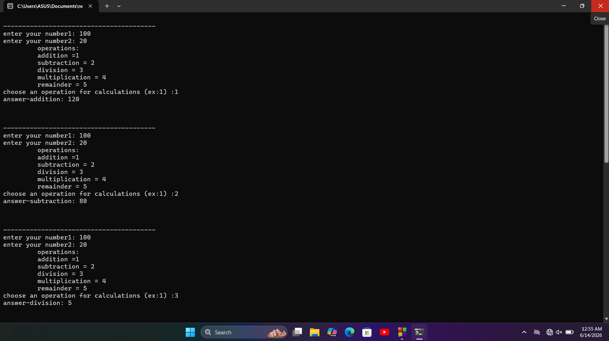

<div align="center">

🧮 Hirushi's Calculator 🚀

*A Simple C Command-Line Calculator*  
No spam welcome messages, just pure calculations! ✨

</div>

---

✨ Features
- ➕ *Addition* - Add two numbers
- ➖ *Subtraction* - Subtract two numbers  
- ✖️ *Multiplication* - Multiply two numbers
- ➗ *Division* - Divide two numbers
- ♻️ *Remainder* - Get modulus of two numbers
- 🔄 *Loop* - Runs continuously until you exit

  ---
  

🛠️ How to Run

1. Compile the code
2. Run the program

📸 Usage Example<br>
 ```bash
enter your number1: 10
enter your number2: 5
   operations: 
     addition = 1  
     subtraction = 2
     division = 3
     multiplication = 4  
     remainder = 5  
choose an operation for calculations (ex:1): 1 
Answer = 15

---

 ```
<div align="center">

</div>


---


<div align="center">

### 📝 About This Project

*This is my very first C programming project* 🚀  
It might look simple, but building it was super interesting! 💡  
I learned a lot while fixing bugs like the welcome message loop 😂  
Planning to add more features & make it better in the future... 🔥

</div>


<div align="center">

Made with ❤️ by Hirushi  
⭐ Star this repo if you liked it!

</div>

